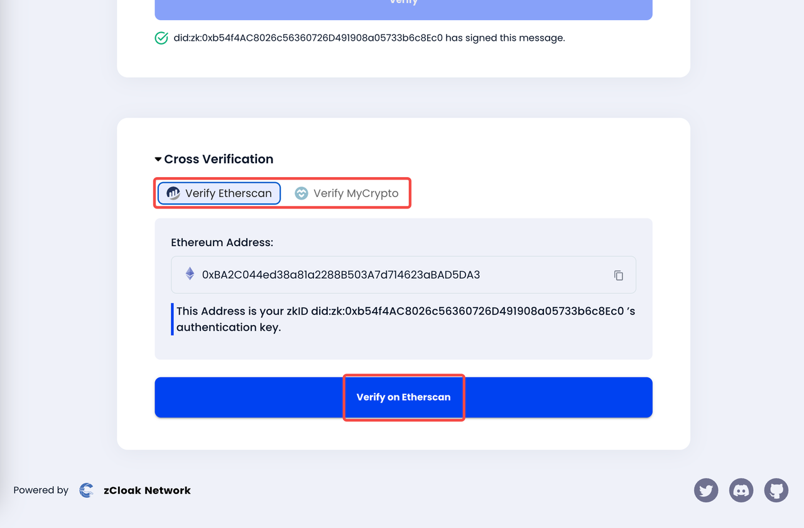

# Valid Sign Tutorial

## Sign

When you want to sign a message you sent to prove that the message originated from you, you can take the following approach.

### 1. Post your Text

For example, you want to post one message with a valid signature on Twitter.

<figure><figcaption></figcaption></figure>

### 2. Login Valid Sign Platform via zkID Wallet

You need to login to signature this message. Here is the link of Valid Sign Platform: [https://sign.valid3.id/](https://sign.valid3.id/)

<figure><figcaption></figcaption></figure>

<figure><figcaption></figcaption></figure>

### 3. Paste the message and sign via zkID Wallet

<figure><figcaption></figcaption></figure>

### 4. Copy the signature information and reply to your original post to make sure others can see your signature

<figure><figcaption></figcaption></figure>

## Verify

If you saw 0xLenhart's post, you can verify his signature as follows.

### 1. Login Valid Sign Platform and paste the signature information

Here is the link of Valid Sign Platform: [https://sign.valid3.id](https://sign.valid3.id)

<figure><figcaption></figcaption></figure>

### 2. Copy the original message and paste it

<figure><figcaption></figcaption></figure>

### 3. Verify it to get the result

<figure><figcaption></figcaption></figure>

You can also see the cross verification results at the bottom of the page

<figure><figcaption></figcaption></figure>
